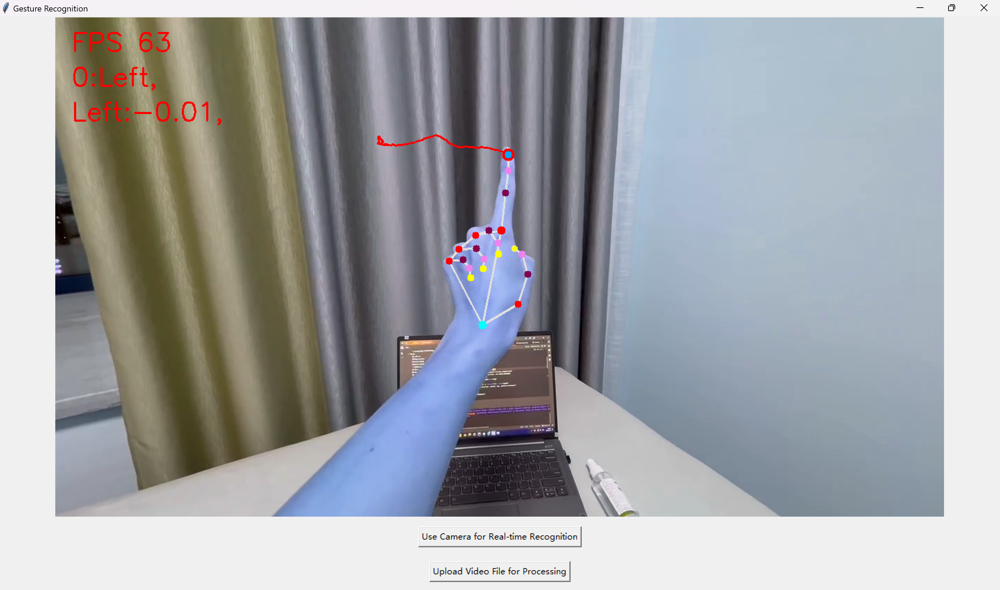

# Mediapipe Gesture Recognition System

English / [中文](readme_zh.md)

↑ 点击切换语言

## Project Overview

This project is a real-time gesture recognition system that captures hand movements through a camera, implementing a basic function of taking screenshots of drawn gesture areas. Other advanced gesture control features can be gradually added in the future as needed.

## Demo

https://github.com/user-attachments/assets/489c1797-fe9a-474a-8dfa-b55c9e482a79

## Table of Contents

- [Features](#features)
- [Multilingual Comments](#multilingual-comments)
- [Installation Steps](#installation-steps)
- [Precautions](#precautions)
- [Usage](#usage)
- [File Structure](#file-structure)
- [Contribution Guidelines](#contribution-guidelines)
- [License](#license)

## Features

- **Real-time Gesture Recognition**: Captures hand gestures in real time through the camera.
- **Finger Drawing**: Draws finger key points on the image, providing intuitive visual feedback.
- **Screenshot Capture**: Automatically generates rectangles based on the drawn trajectory and saves the content within the rectangle to the `image` folder.
- **Graphical User Interface**: Provides an easy-to-use GUI to start the camera, upload videos, and view gesture recognition results.

## Multilingual Comments

To make the code easier to understand for developers from different language backgrounds, this project provides comments in both English and Chinese.

## Installation Steps

1. **Clone the Project**:
   ```bash
   git clone git@github.com:EzraZephyr/Gesture_Recognition-Mediapipe.git
   cd Gesture_Recognition-Mediapipe
   ```   
2. **Install Dependencies:**:
   ```bash
   pip install opencv-python mediapipe filterpy --upgrade
   ```
3. **Run the Project:**:
   ```bash
   python GUI.py
   ```

## Precautions

This project was initially written and debugged on Jupyter Notebook. Therefore, if you want to directly call the camera for debugging and testing, it is recommended to run the `gesture_recognition.ipynb` file.

## Usage



1. **Start the Camera**: After opening the GUI, click the **"Use Camera for Real-time Recognition"** button. The system will automatically capture gestures and display them on the screen.

2. **Upload Video**: Use the **"Upload Video File for Processing"** button to upload a pre-recorded video for gesture recognition.

3. **Gesture Control**: Draw lines on the screen by raising your index finger, and end the drawing by raising both the index and middle fingers (or any action where other key points are higher than the first knuckle of the index finger). The system will generate a rectangle based on the finger's trajectory and automatically capture the content within the rectangular area.

## File Structure

The file structure of the project is as follows:

```c++
Gesture Recognition/
│
├── image/ 
│   └── xxx.jpg
│   
├── utils(en/zh)/
│   ├── finger_drawer.py
│   ├── gesture_data.py
│   ├── gesture_process.py
│   ├── gesture_recognition.ipynb
│   ├── GUI.py
│   ├── hand_gesture.py
│   ├── index_finger.py
│   ├── kalman_filter.py
│   ├── model.py
│   ├── process_images.py
│   └── video_recognition.py
│
├── video/
│   ├── processed_output.mp4
│   └── test.mp4
└── main.py 
```

## Contribution Guidelines

We welcome anyone to contribute to this project. If you wish to contribute code, please follow these steps:

1. **Fork the Repository**: Create a copy of the repository under your own GitHub account.
2. **Create your Feature Branch**:
   ```bash
   git checkout -b feature/AmazingFeature
   ```
3. **Commit your Changes**:
   ```bash
   git commit -m 'Add some AmazingFeature
   ```
4. **Push to the Branch**
   ```bash
   git push origin feature/AmazingFeature
   ```
5. **Open a Pull Request**

## License

This project is licensed under the MIT License. For more details, please refer to the [LICENSE](./LICENSE) file.
